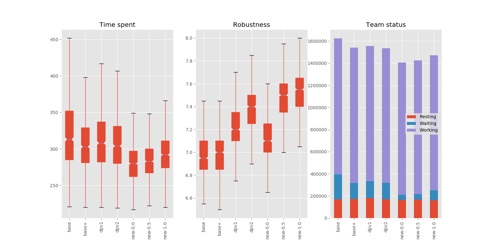

## The Problem

Following the work of Michail Maniadakis & Panos Trahanias on multi-agent planning ([read here](/README.md)),
the same basic assumptions for the planning problem were made while designing the new planning algorithm.
Namely, the principles of Immediate Optimal Planning were kept in order to create a fast algorithm that is
flexible enough to easily adapt to unexpected events in dynamic environments. Also, multi-criteria evaluation
is used for assignment selection, which considers the time needed for an agent to complete a task and also
other quantitative variables like expected robustness level. Finally, fuzzy logic is used for time modeling
and for creating composite scores used for assignment evaluation.


## The Algorithm

The goal of this algorithm is to preserve the usefulness of the previous algorithms in terms of speed and
effectiveness for use in dynamic environments, while improving on the efficiency and providing more options
to the user that would cover a wider range of situational needs.


### Value of assignment

In order to make an informed selection between all possible assignments that can be made, we must first create a metric
of *assignment value* which will provide us a quantitative method for comparing alternative plans.
Intuitively we understand that assignment value should have a positive correlation with robustness (how well the job is
expected to be done), and a negative correlation with time (how much time it will take to get the job done).
Thus, in its simplest form, a metric for assignment value looks like this:
```
V = R / T
```
where:
- `R` is the expected level of robustness, integer in `[0, 10]`
- `T` is the expected time to complete, any positive real number

The above equation implies that different R, T tuples will produce the same assignment value if they have the same ratio between them.
As an example, an assignment of R:5, T:50 will have a value of 0.1, same as an assignment of R:9, T:90.
Although it is reasonable to expect more cost in time when the expected quality of the outcome is greater,
at the same time different situations create different needs.
In some cases the priority might be the completion of the job at hand as fast as possible with complete disregard of the outcome's quality,
while in other cases the priority might be quality of the outcome with complete disregard of the time needed.
Of course, in between these two extreme cases lies a whole spectrum of cases with different needs on speed and quality.
A generalization of the above equation that would enable all these different modes of planning is the following:
```
V = R<sup>m</sup> / T<sup>(1-m)</sup>
```
where:
- `m` is the planners hyperparameter which determines the priorities in robustness and time of the particular case.
A value of `0` disregards robustness, a value of `1` disregards time spent, a value of `0.5` restores the original balance to the
equation, and of course every other value in `[0, 1]` can be used to address the particular needs of any case.

This notion of assignment value will be the basis for evaluating different assignment options throughout the behavior. 


### Vanilla scores

Given the fact that different agents can have different skills, we can compare the values that each agent can produce if
assigned to a specific task. This way we can discover the agents that are the best fit for each task given their particular skill-sets.
At this point we do not need to consider the agent status or the constraints of the task, and that is why refer to these
assignment values as *vanilla scores*. These scores are calculated with the following formula:
```
VS = MR<sup>m</sup> / TT<sub>v</sub><sup>(1-m)</sup>
```
where:
- `MR` is the minimum level of robustness expected of a given agent across all actions of a given task
- `TT<sub>v</sub>` is the total time needed for an agent to complete all actions of a given task

Given the vanilla scores table for each task in behavior vs each agent in the team we can find the maximum value the
assignment of a specific task can produce given the characteristics of the team assigned to the behavior. Thus we define
as *maximum vanilla score* of a task as following:
```
MVS = max{VS<sub>i</sub> for each agent i in team}
```

These maximum vanilla scores only need to be calculated once for each task at the start of the behavior and will be repeatedly
used for comparing alternative assignments every time a need for a new assignment rises


### Absolute & Relative values

When an agent is at rest while there are available tasks, a new assignment has to be made. The first step is to calculate the
*absolute value* produced from assigning any task to any agent and this is done by applying the basic formula from above:
```
AV = MR<sup>m</sup> / TT<sup>(1-m)</sup>
```
However, in this case `TT` denotes the total time needed for an agent to complete a task *including* the expected time
for the agent to become available *and* the expected time for each action of the task to become unconstrained. Of course,
parts of these times may overlap, as the time needed for an agent to complete his previous task may suffice for the
constraints of a task to also be met. In any case, we expect the absolute values calculated during the behavior's progress
to be less or equal to the corresponding vanilla scores calculated at the start of the behavior assignment.

The next step is to calculate the *relative value* of each assignment given its absolute value and the task's absolute
vanilla score. Relative values are calculated with the following formula:
```
RV = AV / MVS
```
Since we expect absolute values to always be less or equal to the maximum vanilla scores, relative values are inside [0,1].
This is the point where assignment inefficiencies coming from bad agent-task matches, task constraints and occupied agents,
are all combined t a single metric. A relative value of `1` denotes the absolute optimal assignment given the characteristics
of the task, the characteristics of the team and the current state of the world, while values below 1 denote some sort
of inefficiency. Relative values change over time as agents become available and tasks are unconstrained. All in all,
relative values show how good a particular assignment is at a specific point in time.


### Task assignments

After having calculated the relative values for all possible assignments, the planner's job is to select the tasks to
be assigned to the resting agents that would produce the maximum sum of relative values. A simple way this can be done
is by selecting for each agent the task that produces the maximum relative value. A slightly better way is to implement
a tree search for finding the best combination of assignments to be made, instead considering assignments for each agent
individually. (TODO) 


### Advantages

The above algorithm for task assignments provides several benefits over the existing algorithms in this area:

1. Unified model for evaluating assignments based on task constraints, agent's state, and agent's skills.  
Using this model there is no need to consider only unconstrained or minimally constrained tasks for each assignments.
Effectively, this model classifies tasks as unconstrained, predictably constrained, and unpredictably constrained.
Tasks of the first two categories are treated similarly since any practical difference between them is calculated
in their relative scores. Only unpredictably constrained tasks are avoided to be assigned, thus creating a bigger space
of evaluated options.

2. Immediate Optimal Planning with a twist.  
Although the goal of this algorithm is not to produce a globally optimum sequence of task assignments, since that would
have a big computational cost thus effectively reducing the desired flexibility of the algorithm, it does try to make more sophisticated
decisions by considering more things than just the current state of the world. Expected times for agents to be available
and for tasks to be unconstrained can be very useful for efficient task assignments. Also, having a rough plan for every
agent's next step in the behavior when using the tree search method for decisions on combinations of assignments to agents
can also improve the algorithm's effectiveness. 

3. User defined robustness-vs-time modulator.  
Instead of implicitly assuming the desired ratio between time and robustness, this algorithm explicitly asks the user to
set it, thus making the algorithm more useful in a wider range of situations, where for example only the time or only the
robustness of an activity should be considered, or any other ratio of the two.


## Experiments

### Results

Below are cited the results from one experiment run (experiment id: 1000), consisting of 1000 simulations (100 different scenarios, 10 times each) for each planner.
All the algorithms presented [here](/README.md#algorithms) were used for the experiment, and the new planner was used with 3 different values of `m` (0.0, 0.5, 1.0).

To reproduce the experiment results, run `experiment.py` and then `analysis.py`, both with the default parameters.

| | base | base+ | dpv1 | dpv2 | new-0.0 | new-0.5 | new-1.0 |
| --- | --- | --- | --- | --- | --- | --- | --- |
| Behaviors completed | 1000 | 1000 | 1000 | 1000 | 1000 | 1000 | 1000 |
| Time spent mean | 324.80 | 308.34 | 311.22 | 307.21 | 281.22 | 285.22 | 294.19 |  
| Time spent std | 58.65 | 42.27 | 40.71 | 38.67 | 29.59 | 30.01 | 31.99 |
| Robustness mean |6.97 | 6.98 | 7.21 | 7.37 | 7.13 | 7.47 | 7.52 |
| Robustness std | 0.18 | 0.18 | 0.19 | 0.20 | 0.19 | 0.23 | 0.22 |
| Waiting time total | 226907 | 144105 | 154674 | 148771 | 44478 | 50090 | 89858 |




### Observations

- All planners were able to successfully complete every behavior assigned to the them.
- The 3 modes of the new algorithm produce the expected results, namely `m=0` being the fastest but least robust option of the three, `m=1` being the most robust but slowest option of the three, and `m=0.5` being a good balance between the other two.
- The new planner was able to achieve significantly lower behavior completion times than the rest of the algorithms, even when run with `m=1` (the most robust but slowest option). The standard deviations of the corresponding distributions were also significantly lower.
- The new planner was also able to achieve significantly higher robustness levels than the rest of the algorithms, except for the case of `m=0` (the fastest option which completely disregards robustness levels).
- The waiting times for all three modes of the new planner are also significantly lower than the waiting times of the rest of the algorithms.
 

### Conclusions

From the results above, the new planner appears to be a promising new approach to the problem of immediate optimal multi-criteria planning.
It showed significant improvement of completion times and robustness levels across a wide range of scenarios against existing algorithms.
The `m` parameter for modulating the way the planner works appears to provide a range of meaningful different options to the user,
while the value of `0.5` specifically produced very good results on every metric, only a little worse from the best results achieved on each case,
making it a valid option for balanced results across the board, and thus the recommended default value for the algorithm.
